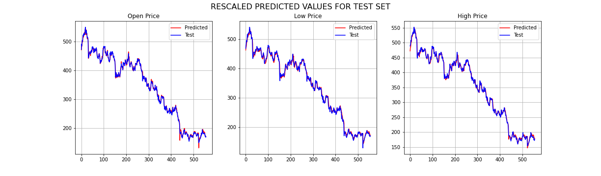

# NNFL-Design-Project-2020

## PROJECT PAPER
This is the [link](https://link.springer.com/article/10.1007/s13042-019-01041-1) to the paper.

## PROJECT PRESENTATION
This is the [project presentation](https://github.com/niravbhandari2000/NNFL-Design-Project-2020/blob/master/NNFL%20Project%20Presentation.pdf).

## MODEL FILES
The [Main Model](https://github.com/niravbhandari2000/NNFL-Design-Project-2020/blob/master/ADRNN_Model_Final.ipynb)
is the Associated Deep Recurrent Neural Network model which predicts Open Price, Low Price and High Price of a Stock.
The [LSTM Model](https://github.com/niravbhandari2000/NNFL-Design-Project-2020/blob/master/LSTM_model_for_comparision.ipynb)
and 
[DRNN Model](https://github.com/niravbhandari2000/NNFL-Design-Project-2020/blob/master/DRNN_model_for_comparision.ipynb)
are other existing models which are used for comparison against the main model.

The main model uses value predicted by one network as an input to another network as shown in the figure below.

## DATA
The data files are the stock data which can be downloaded from [nseindia.com.](https://www1.nseindia.com/products/content/equities/equities/eq_security.htm)
We have arbitrarily taken Tata Motors (ISIN: INE155A01022) stock prices. The files are available in year wise data. 15 years of data is concatenated [here](https://github.com/niravbhandari2000/NNFL-Design-Project-2020/blob/master/tata_dataset.csv). The user may take any other stock price as well.

## PREDICTION BY THE FINAL MODEL

These graphs depict the predicted values of all the output parameters of the model, namely Open-Price, Low-Price and High-Price. They have been compared with the test data, and it is evident that the predicted plots map the test data quite accurately. 

The loss values for the Final Model(ADRNN) has been compared with the values of the DRNN as well the LSTM model respectively for different number of epochs in the folowing table. This table is thus able to prove the conclusion of the research paper which has been implemented, that the ADRNN Model is better than the rest of the models.

|        |	         |   ADRNN   |           |	         |   DRNN    |           |	         |  LSTM     |           |
| ------ | --------- | --------- | --------- | --------- | --------- | --------- | --------- | --------- | --------- |
| Epochs |	OP       |	LP       |	HP       |	OP       |	LP       |	HP       |	OP       |	LP       |	HP       |
| 20     |	2.00E-05 |	4.00E-05 |	3.00E-05 |	5.00E-05 |	7.00E-05 |	5.00E-05 |	9.00E-05 |	1.50E-04 |	8.00E-05 |
| 40     |	2.00E-05 |	4.00E-05 |	2.00E-05 |	2.00E-05 |	5.00E-05 |	4.00E-05 |	4.00E-05 |	7.00E-05 |	4.00E-05 |
| 60     |	1.37E-05 |	4.00E-05 |	2.00E-05 |	2.00E-05 |	4.00E-05 |	3.00E-05 |	2.00E-05 |	5.00E-05 |	3.00E-05 |

## ISSUES WITH GETTING IT TO WORK RIGHT:

The major problem that was encountered during the training phase was that the model wasn’t treating the three LSTM layers differently, and considering it as one connected layer. Due to this our weights were not trained effectively which in turn gave a very high loss (~ 30%). 

Therefore the three different layers were trained separately, and this approach gave the expected results and the loss was drastically improved.

## INSTRUCTIONS TO RUN THE PYTHON FILE:
1) To run any file, please open it with google colab, whose link is provided in the github repository itself. 
2) You will have to upload the
[tata_dataset.csv](https://github.com/niravbhandari2000/NNFL-Design-Project-2020/blob/master/tata_dataset.csv)
file while running the command in the sixth code block 'uploaded = files.upload()'. This will upload the 
   the dataset to the file.
3) After this all the files will run smoothly.

